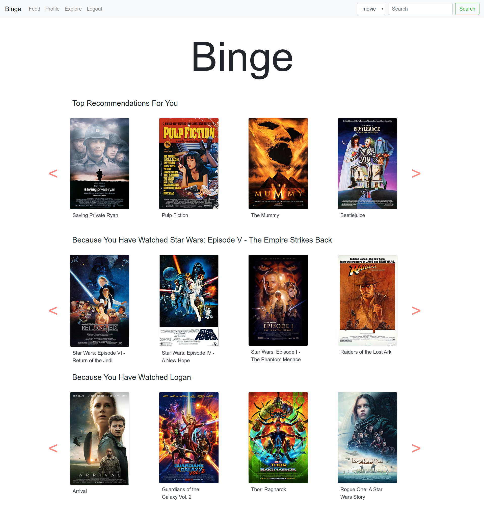

# Binge
Binge is a movie recommendation and review website built with flask as backend and implicit for generating recommendations.

This project uses ALS and approximate nearest neighbours (NMSLib) algorithm for generating recommendations.

All the data is stored in a sqlite database (`app.db`). For implimentation purpose dummy users are created using moviewlens 100K dataset.



# Features
- Recommendations based on user as well as similar movies. Write reviews and give rating.
  
  

- Follow users to see thier reviews in feed.
  
  

- Search movies and users (used flask-msearch)
  
  
  
- Admin view (localhost:5000/admin) (only accessible by user with `role='ADMIN'`)
  
  

# Setup and Usage
setup conda environment

```
conda create --name binge --file=environment.yml
```

run the server

```
conda activate binge 
flask run
```

# Dependencies
- [flask](https://github.com/pallets/flask)
- [flask-admin](https://github.com/flask-admin/flask-admin)
- [flask-login](https://github.com/maxcountryman/flask-login)
- [flask-mail](https://github.com/mattupstate/flask-mail)
- [flask-migrate](https://github.com/miguelgrinberg/Flask-Migrate)
- [flask-msearch](https://github.com/honmaple/flask-msearch)
- [flask-sqlalchemy](https://github.com/pallets/flask-sqlalchemy)
- [flask-wtf](https://github.com/lepture/flask-wtf)
- [implicit](https://github.com/benfred/implicit)
- [nmslib](https://github.com/nmslib/nmslib)
- [pandas](https://github.com/pandas-dev/pandas)

# Login Crednetials
- A dummy admin is present in the database\
  username: susan\
  password: password
- Other dummy accounts include\
  username: cooper, susan3 to susan610\
  password: dogs